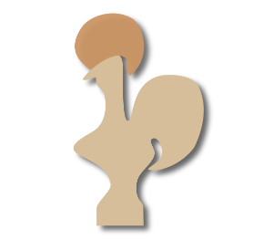

<h1 align="center" style="color:#FFFFFF;">¡Hi, I'M GABRIELA LÓPEZ! 👽✨ </h1>

  
   
  
  

## 👧🏻 ABOUT ME 

Passionate about fields such as Artificial Intelligence and Cybersecurity. My goal is to enter
the professional world with a strong desire to continue acquiring new knowledge and experiences that contribute to my ongoing growth.

* 🌍  I'm based in México.
* ✉️  You can contact me at [gabriela\_164@ciencias.unam.mx](mailto:gabriela_164@ciencias.unam.mx)
* 🧠  I'm learning Angular and Javascript
* 🤝  I'm open to collaborating on Security Research Projects, AI Model Development, Web Application Development, Database Management, Backend Security and Authentication,etc.
* ❤️‍🩹 I love cats and dogs, taking care of myself mentally and physically, as well as spending quality time with my family. 

## 🛠️ MY SKILLS:

* **PROGRAMMING LANGUAGES**

<table>
  <tr>
    <th> ICON <th>
    <th> NAME <th>
  </tr>
  <tr>
    <td> 
    
    <td>
    <td> Java  <td>
  </tr>
  <tr>
    <td>  <td>
    <td> Python <td>
  </tr>
  <tr>
    <td>  <td>
    <td> C  <td>
  </tr>
  <tr>
    <td>  <td>
    <td> R <td>
  </tr>
</table>

<table>
  <tr>
    <th> ICON <th>
    <th> NAME <th>
  </tr>
  
  <tr>
    <td>  <td>
    <td> Haskell <td>
    <tr>
      <td>  <td>
      <td> Racket <td>
    <tr>
      <td>  <td>
      <td> Coq <td>
    <tr>
      <td>  <td>
      <td> Prolog <td>
  </tr>
</table>

* **BACKEND &nbsp;&nbsp;&nbsp;&nbsp;&nbsp;&nbsp;&nbsp;&nbsp;&nbsp;&nbsp;&nbsp;&nbsp;&nbsp;&nbsp;&nbsp;&nbsp;&nbsp;&nbsp;&nbsp;&nbsp;&nbsp;&nbsp;&nbsp;&nbsp;&nbsp;&nbsp;&nbsp;&nbsp;&nbsp;&nbsp;&nbsp;&nbsp;&nbsp;&nbsp;&nbsp;&nbsp;&nbsp;&nbsp;&nbsp;&nbsp;&nbsp;&nbsp;&nbsp;&nbsp;&nbsp;&nbsp;&nbsp;&nbsp;&nbsp;&nbsp;&nbsp;&nbsp;&nbsp;&nbsp;&nbsp;&nbsp;&nbsp;&nbsp;&nbsp;&nbsp;&nbsp;&nbsp;&nbsp;&nbsp;&nbsp;&nbsp;&nbsp;&nbsp;&nbsp;&nbsp;&nbsp;&nbsp;&nbsp;&nbsp;&nbsp;&nbsp;&nbsp;&nbsp;&nbsp;&nbsp;&nbsp; DATABASE**

<table>
  <tr>
    <th> ICON <th>
    <th> NAME <th>
  </tr>
  <tr>
    <td> 
    
    <td>
    <td> Django <td>
  </tr>
  <tr>
    <td>  <td>
    <td> Flask <td>
  </tr>
  <tr>
    <td>  <td>
    <td> Kotlin <td>
  </tr>
</table>

<table>
  <tr>
    <th> ICON <th>
    <th> NAME <th>
  </tr>
  <tr>
    <td> 
    
    <td>
    <td> Myqql <td>
  </tr>
  <tr>
    <td>  <td>
    <td> PostgreSQL <td>
  </tr>
  <tr>
</table>

* **FRONTED &nbsp;&nbsp;&nbsp;&nbsp;&nbsp;&nbsp;&nbsp;&nbsp;&nbsp;&nbsp;&nbsp;&nbsp;&nbsp;&nbsp;&nbsp;&nbsp;&nbsp;&nbsp;&nbsp;&nbsp;&nbsp;&nbsp;&nbsp;&nbsp;&nbsp;&nbsp;&nbsp;&nbsp;&nbsp;&nbsp;&nbsp;&nbsp;&nbsp;&nbsp;&nbsp;&nbsp;&nbsp;&nbsp;&nbsp;&nbsp;&nbsp;&nbsp;&nbsp;&nbsp;&nbsp;&nbsp;&nbsp;&nbsp;&nbsp;&nbsp;&nbsp;&nbsp;&nbsp;&nbsp;&nbsp;&nbsp;&nbsp;&nbsp;&nbsp;&nbsp;&nbsp;&nbsp;&nbsp;&nbsp;&nbsp;&nbsp;&nbsp;&nbsp;&nbsp;&nbsp;&nbsp;&nbsp;&nbsp;&nbsp;&nbsp;&nbsp;&nbsp;&nbsp;&nbsp;&nbsp;&nbsp;&nbsp;&nbsp;&nbsp;&nbsp; SISTEMAS OPERATIVOS**

<table>
  <tr>
    <th> ICON <th>
    <th> NAME <th>
  </tr>
  <tr>
    <td> 
    
    <td>
    <td> Javascript <td>
  </tr>
  <tr>
    <td>  <td>
    <td> HTML <td>
  </tr>
  <tr>
    <td>  <td>
    <td> CSS <td>
  </tr>
  <tr>
    <td>  <td>
    <td> React <td>
  </tr>
  <tr>
    <td>  <td>
    <td> Bootstrap <td>
  </tr>
</table>

<table>
  <tr>
    <th> ICON <th>
    <th> NAME <th>
  </tr>
  <tr>
    <td> 
    
    <td>
    <td> Linux  <td>
  </tr>
  <tr>
    <td>  <td>
    <td> Windows <td>
  </tr>
  <tr>
    <td>  <td>
    <td> Kali  <td>
  </tr>
  <tr>
    <td>  <td>
    <td> Debian <td>
  </tr>
  <tr>
    <td>  <td>
    <td> Powershell <td>
  </tr>
</table>

* **WORK TOOLS**

<table>
  <tr>
    <th> ICON <th>
    <th> NAME <th>
  </tr>
  <tr>
    <td> 
    
    <td>
    <td> Android Studio  <td>
  </tr>
  <tr>
    <td>  <td>
    <td> Git <td>
  </tr>
  
  <tr>
    <td>  <td>
    <td> Latex <td>
  </tr>
  <tr>
    <td>  <td>
    <td> Visual Studio Code <td>
  </tr>
  <tr>
    <td> 
    
    <td>
    <td> Docker  <td>
  </tr>
</table>

## 📊 MY GITHUB STATS:
 

 

 

  
   

## 📞 CONTACT ME

 <a href="https://discord.com/users/1141448079644561538" target="_blank" rel="noreferrer"> <picture> <source media="(prefers-color-scheme: dark)" srcset="https://raw.githubusercontent.com/danielcranney/readme-generator/main/public/icons/socials/discord-dark.svg" /> <source media="(prefers-color-scheme: light)" srcset="https://raw.githubusercontent.com/danielcranney/readme-generator/main/public/icons/socials/discord.svg" />  </picture> </a> <a href="https://www.github.com/Gabriela164" target="_blank" rel="noreferrer"> <picture> <source media="(prefers-color-scheme: dark)" srcset="https://raw.githubusercontent.com/danielcranney/readme-generator/main/public/icons/socials/github-dark.svg" /> <source media="(prefers-color-scheme: light)" srcset="https://raw.githubusercontent.com/danielcranney/readme-generator/main/public/icons/socials/github.svg" />  </picture> </a> <a href="https://www.linkedin.com/in/gabriela-l%C3%B3pez-diego-8479aa316/" target="_blank" rel="noreferrer"> <picture> <source media="(prefers-color-scheme: dark)" srcset="https://raw.githubusercontent.com/danielcranney/readme-generator/main/public/icons/socials/linkedin-dark.svg" /> <source media="(prefers-color-scheme: light)" srcset="https://raw.githubusercontent.com/danielcranney/readme-generator/main/public/icons/socials/linkedin.svg" />  </picture> </a>

